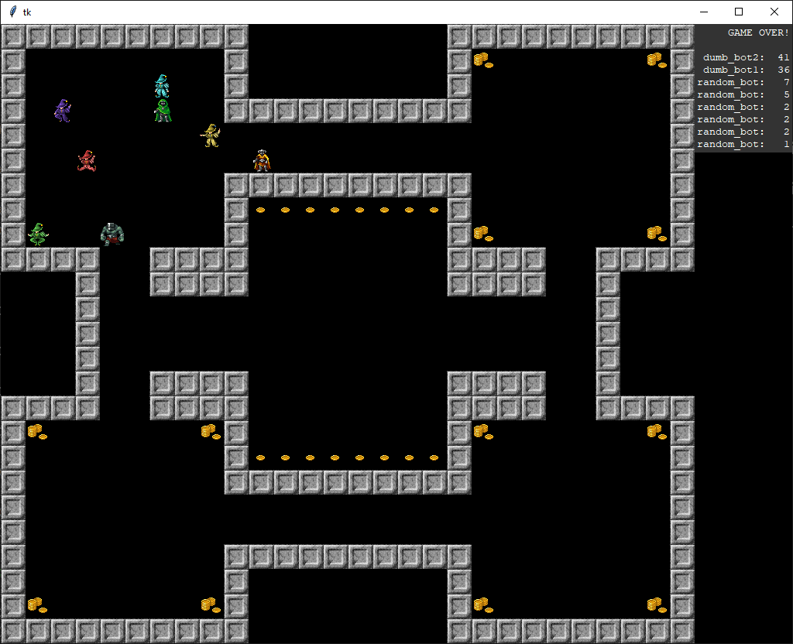

# DandyBot

This is a base version of the game. The development continues [here](https://github.com/Frovu/DandyBot).

А simple programming game. You write Python scripts to control your bot in a roguelike (or [Dandy](https://en.wikipedia.org/wiki/Dandy_(video_game))-like) world. The goal is to collect as much gold as possible in the presence of other bots.

The game uses only the Python standard library. Graphics assets are taken from [here](https://opengameart.org/content/dungeon-crawl-32x32-tiles-supplemental).

See [random_bot.py](random_bot.py) and [user_bot.py](user_bot.py) for API examples.

## Game rules

1. Player should provide a Python script containing `script(check, x, y)` function.
1. Player's function is called on every game tick, and should return player's action.
1. Player should use provided `check` function to check for object at the desired position.
1. Player may check for current level number, but we advice to generalize your code.
1. Player should not use any global data or state.

## API
Player's action is:
+ `"take"` for taking gold from players tile
+ `"left"`, `"right"`, `"up"`, `"down"` for moving
+ `"pass"` for doing essentially nothing

Available check types are:
+ `"gold"` - returns gold amount on tile
+ `"player"` - tells if tile has player on it
+ `"wall"` - tells if tile is impassable
+ `"level"` - returns current level number starting from 1

